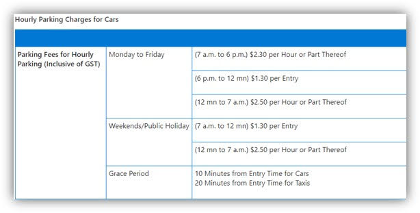

# Venues

You may refer to the latest programme schedule during the programme for the most up-to-date venues for each session, but broadly:

1. All in-person workshops and sessions will be held at **Mapletree Business Centre (MBC) Block 30 Level 11 Jupiter Rooms**.
   1. You have already been pre-registered for building access at MBC30. When you arrive, please approach the security guards at the reception counter and let them know you are here for TechUp, your name as well as your agency.
   2. If you have any issues with accessing the building, please call Dawn at 9631 8021.
   3. Do expect that during the morning peak period, there will be a large number of people lining up at the security counter to enter the building, and waiting to use the limited lifts at the lobby. Do come earlier if you can so that there is sufficient time for you to wait for available lifts to go up to Level 11 where the Jupiter Rooms are.
2. Office hours may be held at either OGP pantry at **Lazada One building (51 Bras Basah Road)** or **MBC30 Jupiter Room / GovTech Pantry**. Please refer to the programme schedule for more details.
3. Web App Presentations on 27 and 28 May are held at **SNDGO office at Funan**. The room allocations will be briefed to you nearer the date.
4. Demo Day on 29 May will be at **MCI Atrium** (public access is possible).

### Additional Notes: 

* **Please be punctual for all sessions** out of respect to the speakers who have put in the effort to make this programme fruitful for you. **We would highly encourage participants to take public transport to MBC especially in the mornings due to bad traffic.**
* If you intend to take taxi / private hire cars, please cater for sufficient buffer time. **You are also highly encouraged to carpool.** Do also make use of the #carpool channel (search: Carpool on Slack) to look for others living near you to carpool to MBC for financial prudence. Please adhere to the transport claim guidelines for your respective agency.

### How to get there



**Address**

Mapletree Business Centre (MBC) Block 30 Level 11 Jupiter Rooms 1 and 2

**Access**

Please provide your full name (as in NRIC) along with your agency name, to Dawn.

**Public Transport**

Nearest MRT station: Labrador Park

**Parking Information**

Please see below for the parking charges at MBC:

<figure><figcaption></figcaption></figure>



**Address**

Funan Tower 2 Level 6

**Access**

Please reach out to Dawn with your full name and mobile number.

**Public Transport**

Nearest MRT station: City Hall, Clarke Quay

**Parking Information**

If you are driving, the nearest carpark is Funan's public carpark.



**Address**

51 Bras Basah Road, Lazada One, #04-08 Singapore 189554

**Access**

Please reach out to Dawn with your full name and mobile number.

**Public Transport**

Nearest MRT station: Brash Basah, Bencoolen

**Parking Information**

TBC



**Address**

140 Hill Street #01-01A. Singapore 179369

**Access**

Publicly accessible

**Public Transport**

Nearest MRT station: Clarke Quay, City Hall

**Parking Information**

We highly encourage participants to take public transport due to limited parking available. MCI parking lots are reserved for VIPs. Alternatively, you may wish to park at Clark Quay, which is free for the first 2 hours.


